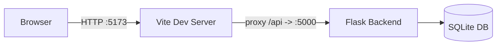

# PHISGUARD Code README (How It Runs)

This guide explains how to run the PHISGUARD codebase for development and demonstration.

## 1) Tech Stack
- Backend: Flask, SQLAlchemy, Flask-Login
- Frontend: React + Vite
- Database: SQLite (development)

## 1.1) Architecture (High Level)

PHISGUARD is a two-process app in development:
- React (Vite) serves the UI on `http://localhost:5173`
- Flask serves the API on `http://127.0.0.1:5000`

The UI calls `/api/...` and Vite proxies those requests to Flask.



Core backend modules:
- App factory: `app/__init__.py`
- Blueprints (routes): `app/blueprints/*`
- Models: `app/models/*`
- Services: `app/services/*`

## 2) Project Entry Points
- Backend app factory: app/__init__.py
- Backend launcher: run.py
- Frontend entry: frontend/src/main.jsx
- Frontend root app: frontend/src/App.jsx

## 3) Prerequisites
- Python 3.10+
- Node.js 18+
- npm

## 4) First-Time Setup

From project root:

```powershell
# 1) Create and activate virtual environment
python -m venv .venv
.\.venv\Scripts\Activate

# 2) Install backend dependencies
pip install -r requirements.txt
```

Then frontend:

```powershell
Set-Location frontend
npm install
Set-Location ..
```

Optional environment file:
- Create .env in project root
- Set values such as SECRET_KEY, ADMIN_PASSWORD, USER_PASSWORD

If not set, defaults are:
- user password: user
- admin password: admin

## 5) Run in Development (Recommended for Demo)

Open two terminals.

Terminal 1 (backend):

```powershell
Set-Location "c:\Users\luhag\phisguard project"
.\.venv\Scripts\Activate
python run.py
```

Terminal 2 (frontend):

```powershell
Set-Location "c:\Users\luhag\phisguard project\frontend"
npm run dev
```

Open:
- Frontend UI: http://localhost:5173
- Backend API base: http://127.0.0.1:5000

Notes:
- Vite proxies /api requests to the Flask backend.
- On startup, backend ensures tables exist and seeds simulation data when needed.

## 6) Build and Run as Single App (Production-Style Demo)

```powershell
Set-Location "c:\Users\luhag\phisguard project\frontend"
npm run build

Set-Location "c:\Users\luhag\phisguard project"
.\.venv\Scripts\Activate
python run.py
```

Open: http://127.0.0.1:5000

## 7) Main Runtime Flow
1. User logs in with name + password.
2. User opens Email/SMS scenarios in Simulation.
3. User clicks or reports messages.
4. Backend stores actions and computes feedback.
5. Feedback page and simulation summary load user history from backend endpoints.
6. Awareness metrics are calculated for the logged-in user.

## 8) Key API Endpoints Used by UI
- Auth:
  - POST /api/login
  - POST /api/logout
- Simulation:
  - GET /api/emails
  - POST /api/emails/:id/open
  - POST /api/emails/:id/click
  - POST /api/emails/:id/report
  - GET /api/sms
  - POST /api/sms/:id/open
  - POST /api/sms/:id/click
  - POST /api/sms/:id/report
- Feedback and learning:
  - GET /api/feedback
  - POST /api/feedback/reset
  - GET /api/awareness
- Admin:
  - GET/POST /api/templates
  - GET/POST /api/targets
  - GET/POST /api/campaigns

## 9) Login Accounts for Demo
- User login:
  - Name: any non-empty name
  - Password: user (or USER_PASSWORD from .env)
- Admin login:
  - Password: admin (or ADMIN_PASSWORD from .env)

## 10) Quick Troubleshooting
- Backend import errors:
  - Ensure terminal current folder is project root before running python run.py.
- Frontend cannot reach API:
  - Ensure backend is running on 127.0.0.1:5000.
- 401 unauthorized after backend restart:
  - Tokens are stored in-memory for local development, so restarting Flask invalidates existing tokens. Log in again.
- No feedback appears:
  - Confirm you are logged in and actions were performed (click/report).
- Fresh demo reset:
  - Use Restart Progress button in Simulation (calls /api/feedback/reset).

## 11) Suggested 5-Minute Demo Sequence
1. Login as user.
2. Open Simulation and perform a few Email and SMS actions.
3. Show immediate feedback and score/progress updates.
4. Open Awareness page and explain training checklist.
5. Open Feedback page and show persisted history.
6. Login as admin and show templates/targets/campaigns/metrics.
